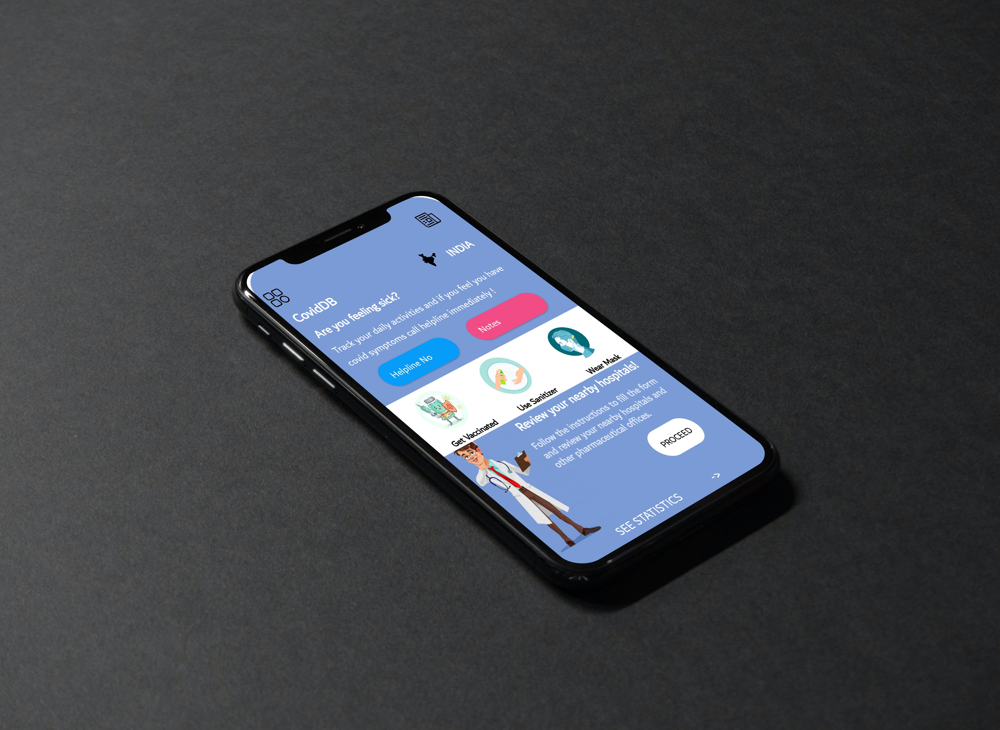

# CoviDB-App

## About the App
### Developed Using Android Studio
Android Studio is the official integrated development environment (IDE) for Google's Android operating system, built on JetBrains' IntelliJ IDEA software and designed specifically for Android development.It is available for download on Windows, macOS and Linux based operating systems or as a subscription-based service in 2020.It is a replacement for the Eclipse Android Development Tools (E-ADT) as the primary IDE for native Android application development.
### Research
As hospitals in Delhi and many other cities run out of beds, people have been forced to find ways to get treatment for sick patients at home. Many have turned to the black market, where prices of essential medicines, oxygen cylinders and concentrators have skyrocketed and questionable drugs are now proliferating.Anshu Priya could not get a hospital bed in Delhi or its suburb of Noida for her father-in-law and as his condition continued to deteriorate. She spent most of her time looking for an oxygen cylinder but her search was futile.

So she finally turned to the black market. She paid a hefty amount - 50,000 rupees ($670; £480) - to procure a cylinder that normally costs 6,000 rupees. With her mother-in-law also struggling to breathe, Anshu knew she may not be able to find or afford another cylinder on the black market.
This is a familiar story not just in Delhi but also in Noida, Lucknow, Allahabad, Indore and so many other cities where families are desperately cobbling together makeshift arrangements at home.

But most of India's population cannot afford to do this. There are already several reports of people dying at the doorsteps of hospitals because they couldn't afford to buy essential drugs and oxygen on the black market.
### App Overview

With so much chaos we want to bring calmness in market. Help people in any way we can. CovidDB app provides various functionalities to deal with this such as :-

#### 1. Review Forms
With these forms user can fill in their application and review their hospitals and other pharmaceutical offices they have visited recently.New patients can read these reviews to get better understanding how nowadays these offices/pharmacy really work.

To avoid fake review forms Secure Login and patient details are recorded.

#### 2. Health Tracker Note Application
Still none of us are recording our general health stat on daily basis.Being a covid sufferer I know how important is to stay healthy on regular basis and record our health stats such temperature, Body Weight , Oxygen levels and other important stats. 

#### 3. Helpline Info
Idea is to track your health and if you fall sick then to help by providing helpline Numbers central as well as State wise.

#### 4. Global Data Analysis
Comparing how covid data are changing around compared to India could help us analyse country's performance against this pandemic.

## Download Our App

https://drive.google.com/drive/folders/1Q13s-EWw-VIB8DknBYBISHFnz_W04QuQ?usp=sharing

## Follow Protocols
#### Wear Mask
#### Sanitize Well
#### Maintain Social Distancing

