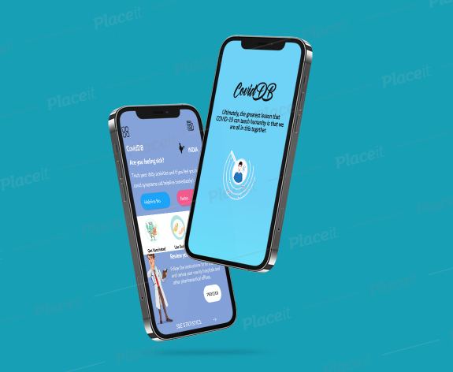

# CoviDB-App

## 1. About the App
### Developed Using Android Studio
Android Studio is the official integrated development environment (IDE) for Google's Android operating system, built on JetBrains' IntelliJ IDEA software and designed specifically for Android development.It is available for download on Windows, macOS and Linux based operating systems or as a subscription-based service in 2020.It is a replacement for the Eclipse Android Development Tools (E-ADT) as the primary IDE for native Android application development.
